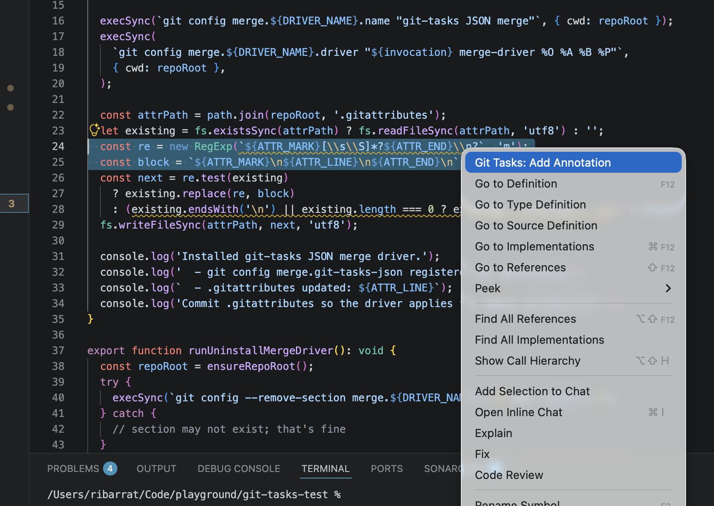
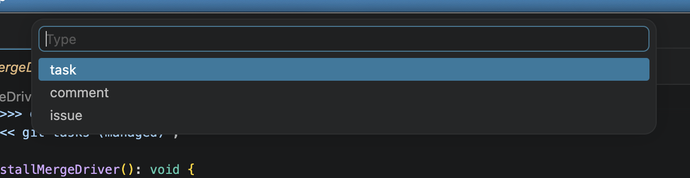
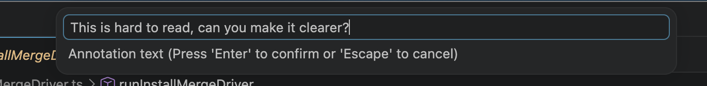
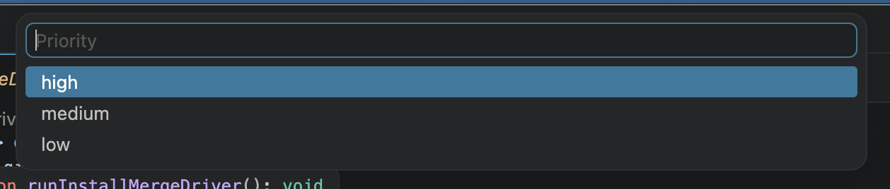
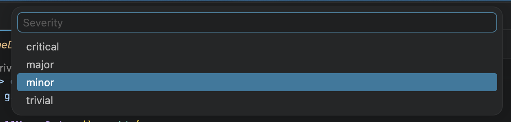
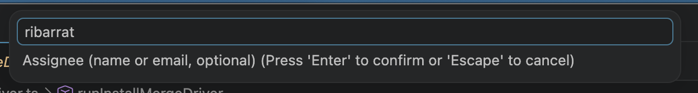
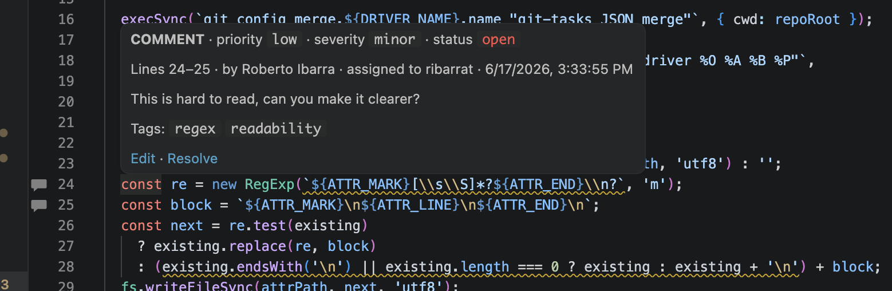
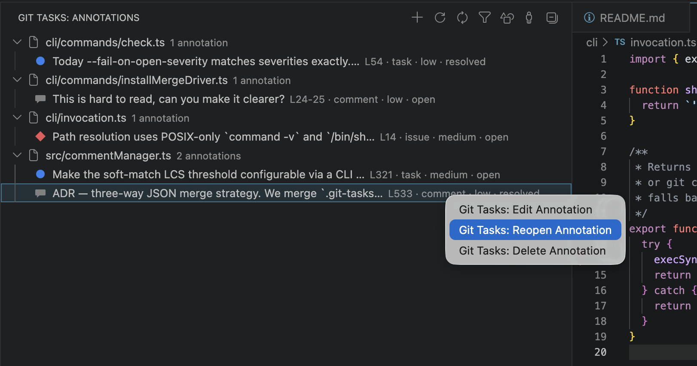
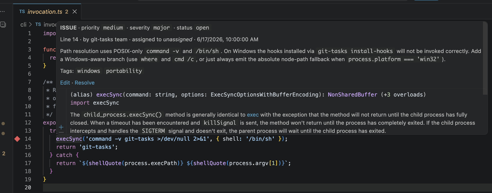
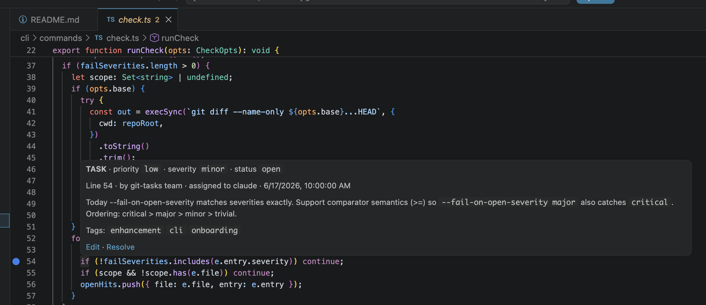

# git-tasks

**Structured, line-pinned annotations that live inside your Git repository — designed to improve team collaboration and deployment pipelines.**

Most context about a codebase lives outside it: in tickets, chats, PR comments that get archived, and `// TODO:` strings that nobody can query. git-tasks brings that context back into the repo as structured JSON, pinned to the exact lines it describes, so the whole development cycle can read and act on it.

## Why it's different by design

- **Annotations travel with the code.** They're plain JSON files under `.git-tasks/`, committed alongside the source. Clone the repo and every task, comment, and issue is already there, pinned to the right line. Branches carry their own annotations. Merges merge the notes.
- **Pinned to ranges, not floating tickets.** Every entry stores `(file, lineRange, commitSHA, lineContent snapshot)`. When the surrounding code moves or changes, git-tasks shows a drift warning instead of silently rotting the reference.
- **Diffable, reviewable, blameable.** Adding or resolving a note is a normal commit — it shows up in code review, `git blame` tells you who wrote it, and `git log` is the audit trail.
- **No server, no login, no lock-in.** There is nothing to provision. The data is in the repo; the tools just read and write it.

## Built for three audiences at once

### Humans
A VS Code extension surfaces annotations as gutter icons, hover tooltips, and a sidebar grouped by file — with an accent ring on anything assigned to you. The `git-tasks` CLI gives the same view in any terminal, with `--mine`, `--type`, `--status`, and `--json` filters for everyday workflows.

### AI coding agents
The schema is stable, fully documented, and machine-readable. An agent can:

- `git-tasks list --json --assignee <agent-id> --status open` to discover work assigned to it,
- read the `lineContent`, `commitSHA`, and `text` to understand the exact context,
- make the change,
- `git-tasks update <id> --status resolved` to close the loop —

all without an API key, a webhook, or an external service. The repo is the queue, the queue is the repo.

### CI/CD pipelines
Because annotations are committed JSON, pipelines can treat them as first-class signals:

- block a release if any `severity: critical` issue is `open`,
- post counts per type/priority to a dashboard on every push,
- enforce "no unresolved tasks touching `src/payments/**` on merge to `main`",
- auto-assign by tag, or notify on Slack when an issue is added in a hot path.

No bot account, no API rate limits — just a `jq` over a folder of JSON files.

## What it's for

git-tasks is for **enhancing the development cycle**, not for managing projects. It's the layer that captures and acts on the small-grained, code-attached context that today gets lost in chat threads, dropped TODOs, and stale review comments — and exposes it equally to the developer in their editor, the agent doing the work, and the pipeline shipping it.

---

## Install

### VS Code extension

```bash
git clone <this repo>
cd git-tasks
npm install
npm run compile
```

Then press `F5` in VS Code to launch an Extension Development Host with the extension loaded.

This works because the repo includes `.vscode/launch.json` configured with an `extensionHost` debug target. VS Code reads the `contributes` section of `package.json` (which declares the commands, sidebar view, and gutter decorations) and loads the compiled output from `out/` — no marketplace publish required. The Extension Development Host is a second VS Code window that runs the extension locally, exactly as it would if it were installed.

### CLI

Once published to npm:

```bash
npm install -g git-tasks
```

During development (in the repo root):

```bash
npm run compile
npm link          # symlinks `git-tasks` → out/cli/index.js globally
git-tasks list    # works in any terminal from here on
```

To remove the symlink when done: `npm unlink git-tasks`.

---

## Testing

The repo has a [vitest](https://vitest.dev/) suite covering the core annotation engine, the git helper, and the CLI surface most exercised by CI integrations.

```bash
npm test            # compile + run the whole suite
npm run test:watch  # iterative dev loop
npm run test:coverage
```

What's covered:

| Layer | File | Approach |
|---|---|---|
| Annotation engine (`src/taskManager.ts`) | `test/taskManager.test.ts` | Unit tests for the pure helpers (`extractLineContent`, `findSnapshotIn`, `softMatchSnapshot`, three-way merge) and on-disk lifecycle (`addEntry` → `updateEntry` → `removeEntry`, `reconcileAll` against a real temp repo). |
| Git helper (`src/gitHelper.ts`) | `test/gitHelper.test.ts` | Runs against a real temp `git init` repo — no mocks — to verify `findRepoRoot`, `getCurrentCommitSHA`, `isCurrentUser`, etc. |
| CLI (`cli/commands/*`) | `test/cli.test.ts` | Shells out to the compiled `out/cli/index.js` inside a temp repo and asserts exit codes, JSON shape, and on-disk state. Focused on the commands that pipelines depend on: `list`, `show`, `update`, `remove`, `reconcile`, `check`, `diff`. |

VS Code extension surface (`gutterProvider`, `sidebarProvider`, `hoverProvider`, `fileWatcher`) is intentionally **not** covered — it's thin glue over the engine, and reliable VS Code UI testing requires a full `@vscode/test-electron` host that costs more to maintain than it pays back here.

Tests scaffold isolated temp repos via `test/helpers.ts`:

- each `makeTempRepo()` does a real `git init` in `os.tmpdir()`, configures a fixed identity, and seeds an initial commit;
- `GIT_CONFIG_GLOBAL`/`GIT_CONFIG_SYSTEM` are pinned to `/dev/null` so the suite never reads or mutates the developer's global git config;
- `cleanup()` removes the temp directory in `afterEach`.

A `pretest` npm hook re-runs `tsc` so the CLI integration tests always exercise the latest compiled output; CI does the same via `npm run compile` followed by `npm test`.

---

## Usage

### VS Code

1. Select one or more lines in any file inside a Git repository.
2. Run **Git Tasks: Add Annotation** from the command palette (or the right-click menu).



3. Pick a type, enter your text, set priority/severity/assignee/tags.











4. The annotation appears as a gutter icon and in the **Git Tasks** sidebar panel.





Icons in the gutter:

| Icon | Meaning |
|------|---------|
| ● (blue) | task |
| 💬 (gray) | comment |
| ◆ (red) | issue |
| ⚠ (amber) | drift — file content has changed since the annotation was written |
| accent ring | annotation is assigned to **you** (matched against `git config user.name`/`user.email`) |

Issue example:



Task example:



### CLI

```bash
# Add a single-line task
git-tasks add src/auth.js 42 --type task --text "Missing index" --priority high

# Add a range issue
git-tasks add src/auth.js 42-48 --type issue --text "Refactor this block" --severity major

# List everything
git-tasks list

# Only annotations assigned to me
git-tasks list --mine

# Show one annotation in full
git-tasks show a1b2c3

# Update status
git-tasks update a1b2c3 --status resolved

# Remove
git-tasks remove a1b2c3 --force
```

Run `git-tasks --help` for full reference.

---

## Storage / schema

Each annotated source file gets its own JSON file under `.git-tasks/`, mirroring its path:

```
.git-tasks/
  src/
    utils/
      auth.js.json
```

```jsonc
{
  "version": "1.0",
  "file": "src/utils/auth.js",
  "entries": [
    {
      "id": "<uuid-v4>",
      "type": "task",                      // task | comment | issue
      "commitSHA": "<40-char SHA>",
      "line": 42,
      "endLine": 48,                       // optional: only on multi-line selections
      "lineContent": "const user = ...",   // snapshot for drift detection
      "text": "This query has no index — could be slow under load",
      "author": "Riccardo Barrat",
      "assignee": "alice@example.com",     // optional
      "createdAt": "2026-06-16T10:00:00Z",
      "updatedAt": "2026-06-16T10:00:00Z",
      "status": "open",                    // open | in-progress | resolved | closed
      "priority": "high",                  // high | medium | low
      "severity": "major",                 // critical | major | minor | trivial
      "tags": ["perf", "security"]
    }
  ]
}
```

Commit the `.git-tasks/` folder into your repo so teammates can pull and immediately see all annotations.

---

## CLI reference

| Command | What it does |
|---------|--------------|
| `git-tasks add <file> <line>[-<endLine>] --type … --text …` | Add a single- or multi-line annotation |
| `git-tasks list [<file>] [--type] [--status] [--priority] [--assignee] [--mine] [--json]` | List annotations, with filters |
| `git-tasks show <id>` | Show one annotation in full |
| `git-tasks update <id> [--text] [--status] [--priority] [--severity] [--assignee] [--tags]` | Update fields |
| `git-tasks remove <id> [--force]` | Delete |
| `git-tasks reconcile [--dry-run] [--quiet] [--json]` | Relocate drifted annotations; report stale / orphan |
| `git-tasks check [--fail-on …] [--fail-on-open-severity …] [--base <ref>] [--format json]` | CI gate over reconcile + open-severity rules |
| `git-tasks diff --base <ref> [--json] [--github-annotations]` | List annotations on files changed since `<ref>`; emit GitHub Checks inline annotations |
| `git-tasks stats [--sla-days <n>] [--fail-on-aged-critical] [--json]` | Density + SLA report aggregated by file, type, status, severity |
| `git-tasks purge [--status resolved,closed] [--older-than <days>] [--apply] [--force] [--json]` | Bulk-delete terminal tasks. Dry-run by default; `--apply` to actually delete |
| `git-tasks install-hooks` / `uninstall-hooks` | Manage pre-commit / post-merge / post-checkout hooks |
| `git-tasks install-merge-driver` / `uninstall-merge-driver` | Manage the three-way JSON merge driver for `.git-tasks/**/*.json` |

### Output

Rows where `assignee` matches the current git user are prefixed with `→` and bolded.

---

## How drift detection works

When you create an annotation, the lines covered by it are stored verbatim in `lineContent`. If the file is later edited and the live content of those lines no longer matches, the gutter icon switches to an amber `⚠` and the hover tooltip notes that the lines may have moved. The `commitSHA` field also records the exact commit you were on when the annotation was written, so you can always recover the original context via `git show <sha>:<file>`.

---

## Surviving PR merges and conflicts

The whole point of pinning annotations to `(file, lineRange, commitSHA, lineContent)` is that they can heal themselves across merges. Four CLI subcommands cover the lifecycle:

### `git-tasks reconcile`

For every entry, compare the live file against `lineContent`:

- **Match** → nothing to do.
- **Snapshot found elsewhere in the file** → relocate the annotation to the new lines and bump `updatedAt`. Auto-applied.
- **Snapshot only ~partially found** (≥70% line-LCS) → reported as `soft-match`; not auto-applied. Review and resolve manually or via an AI agent.
- **Snapshot no longer found** → reported as `stale`.
- **Source file deleted** → reported as `orphan`.

```bash
git-tasks reconcile              # default: apply moves, report the rest
git-tasks reconcile --dry-run    # report only, write nothing
git-tasks reconcile --json       # machine-readable for CI / agents
```

Exit code is `1` if anything is `stale` or `orphan`, so CI can fail on it.

### `git-tasks install-hooks`

Writes a managed block into `.git/hooks/post-merge` and `.git/hooks/post-checkout`. Each hook runs `git-tasks reconcile --auto --quiet` after every `git pull` or branch checkout, so line shifts heal automatically. The block is idempotent and marked with `# >>> git-tasks (managed)`. Remove with `git-tasks uninstall-hooks`.

### `git-tasks install-merge-driver`

Registers a custom three-way merge driver for `.git-tasks/**/*.json`. When both your branch and theirs add or edit entries in the same annotation file, git would otherwise produce a textual conflict in the JSON. With the driver installed:

- New entries on either side are unioned by `id`.
- Entries edited on only one side take that side.
- Entries edited on both sides do field-wise merge (last `updatedAt` wins for scalar fields; `tags` are unioned).
- A real structural conflict (deleted on one side, edited on the other) still falls back to git's normal markers.

The installer registers `merge.git-tasks-json.driver` in `.git/config` and appends `.git-tasks/**/*.json merge=git-tasks-json` to `.gitattributes`. Commit `.gitattributes` so the driver applies for every collaborator. Remove with `git-tasks uninstall-merge-driver`.

### `git-tasks check`

Designed for `pull_request` CI. Reports drift / soft-match / stale / orphan counts, and optionally fails the build on configurable conditions:

```bash
# fail if any annotations are stale or orphaned
git-tasks check --fail-on stale,orphan

# fail if the PR touches a file with an open critical annotation
git-tasks check --fail-on-open-severity critical --base origin/main

# machine-readable
git-tasks check --format json
```

#### GitHub Actions snippet

```yaml
# .github/workflows/git-tasks.yml
name: git-tasks
on: [pull_request]
jobs:
  check:
    runs-on: ubuntu-latest
    steps:
      - uses: actions/checkout@v4
        with: { fetch-depth: 0 }
      - uses: actions/setup-node@v4
        with: { node-version: 20 }
      - run: npm i -g git-tasks
      - run: git-tasks check --fail-on stale,orphan --fail-on-open-severity critical --base origin/${{ github.base_ref }}
```

### Suggested one-time setup for a team

```bash
git-tasks install-hooks
git-tasks install-merge-driver
git add .gitattributes
git commit -m "git-tasks: enable auto-reconcile on merge"
```

After that, line shifts heal silently on pull, concurrent annotation edits merge without textual conflicts, and CI gates everything else.

`install-hooks` writes three managed blocks:

| Hook | Behavior |
|---|---|
| `pre-commit` | Auto-relocates drifted annotations and re-stages them; **blocks the commit** if anything is `stale` or `orphan`. |
| `post-merge` | Runs `reconcile --auto --quiet` after every `git pull`, so line shifts that landed on the remote heal locally on the next pull. |
| `post-checkout` | Same as `post-merge`, but on branch checkout. |

---

## How this repo dogfoods git-tasks

This repository uses git-tasks on itself, so cloning it is also a working demo and a copy-pasteable template.

### Seeded annotations (`.git-tasks/`)

Four real entries pinned to current source — every CI integration below operates on this data:

| File:line | Type | Tags | Showcases |
|---|---|---|---|
| `src/taskManager.ts:321` | task | `enhancement, good-first-issue, onboarding` | AI-agent + onboarding workflow (assigned to `claude`) |
| `src/taskManager.ts:533` | comment | `merge-driver, onboarding` | **Annotation pinned to the line it describes** — reorganising the merge driver triggers drift on this entry |
| `cli/commands/check.ts:54` | task | `enhancement, cli, onboarding` | AI-agent task with a concrete implementation hint |
| `cli/invocation.ts:14` | issue (`severity: major`) | `windows, portability` | CI's `--fail-on-open-severity critical --base …` gate (triggers when a PR also edits this file) |

Try `git-tasks list --mine`, `git-tasks list --tag onboarding`, or `git-tasks list --tag merge-driver` after cloning.

### Workflows (`.github/workflows/`)

| File | When | What it does |
|---|---|---|
| `ci.yml` → `build` | every push / PR | tsc build |
| `ci.yml` → `pre-merge-check` | PRs | `git-tasks check --fail-on stale,orphan`, blocks PRs that introduce open `critical` issues on the diff, emits **GitHub Checks inline annotations** for every entry on a changed file, and posts a **sticky PR comment** with the full report |
| `ci.yml` → `post-merge-audit` | push to `main` | runs `reconcile` on main; **fails if anything moved**, signalling a contributor merged without local hooks installed |
| `auto-resolve.yml` | push to `main` | scans the merge commit message for `closes git-tasks: <id>` (also `gt-closes <id>`) and auto-resolves the matching entries in a bot-authored follow-up commit |
| `weekly-report.yml` | every Monday + manual | runs `git-tasks stats --sla-days 30`, publishes the report to the workflow summary, fails on aged criticals, and opens / updates a tracking GitHub Issue when it does |

### Local hooks (`git-tasks install-hooks`)

| Hook | Behavior |
|---|---|
| `pre-commit` | Auto-relocates drifted annotations and re-stages them; **blocks the commit** if anything is `stale` or `orphan`. |
| `post-merge` | Runs `reconcile --auto --quiet` after every `git pull`, so line shifts that landed on the remote heal locally on the next pull. |
| `post-checkout` | Same as `post-merge`, but on branch checkout. |

### Replicate in your repo

```bash
git-tasks install-hooks
git-tasks install-merge-driver
cp -R <git-tasks-repo>/.github/workflows/ .github/workflows/
git add .github .gitattributes
git commit -m "ci: wire up git-tasks template"
```

Adjust `--base origin/<your-default-branch>` in `ci.yml` if your default isn't `main`.

---

## Beyond the editor: SDLC integration ideas

Once annotations live in the repo as structured JSON, the same data file plugs into almost every stage of the development lifecycle. Each of the ideas below is a thin reader on top of `.git-tasks/*.json` — no new schema, no new service.

> :sparkles: **Five of these ideas already ship as the template wired up in this repo** — see the [dogfooding tables above](#how-this-repo-dogfoods-git-tasks):
> Checks-API inline annotations + sticky PR comment (`ci.yml`), auto-resolve on `closes git-tasks: <id>` (`auto-resolve.yml`), scheduled SLA report (`weekly-report.yml`), the `git-tasks diff` and `git-tasks stats` commands, an annotation pinned to the line it describes, and an `--tag onboarding` walkthrough. Copy the workflow files and you have the same setup in your repo.

### PR review (biggest visibility lift)

- **Inline diff comments via the GitHub Checks Annotations API.** In a CI workflow, walk every entry whose `line`/`endLine` overlaps the PR diff and emit `::warning file=…,line=…::<text>`. Each annotation then appears as an inline marker in the GitHub diff view, exactly like a linter finding.
- **Sticky PR comment** listing annotations touching the diff, grouped by severity, posted by a workflow with `pull-requests: write`.
- **Auto-resolve on merge.** A workflow that scans the merge commit message for `closes git-tasks: <id>` (or `closes gt:<id>`) and updates those entries' `status` to `resolved` in a follow-up commit — the same UX as `closes #123` for issues.
- **Reconcile-drift gate.** Run `git-tasks reconcile --dry-run` against the PR branch and fail the check if the PR introduces new `stale` or `orphan` entries.

### Production / on-call (biggest leverage)

- **Stack-trace ↔ annotation map.** A Sentry / Datadog / Honeycomb plugin (or a plain webhook) takes each error frame `(file, line, commitSHA)` and reads `.git-tasks/` at the deployed commit. The on-call sees:
  > _"This line was annotated 6 weeks ago by bob@: 'rate-limit me when concurrency > 50'. Status: open, priority: high."_
  Tribal knowledge becomes operational context at the exact moment it's needed.
- **On-call run sheet.** `git-tasks list --tag oncall-watchout --status open --json` becomes the live watch-list, edited by the people who own the code.

### Deploy

- **Gate on open criticals.** Wrap your deploy script with:
  ```bash
  git-tasks check --fail-on-open-severity critical --base <last-deployed-sha>
  ```
  Block ships that carry unresolved criticals on touched files. One CLI call, no ticket-tracker API.
- **Auto-generated release notes.**
  ```bash
  git-tasks list --status resolved --json |
    jq '[.[] | select(.updatedAt > "<last-tag-date>")]'
  ```
  Feeds a "What was fixed" section into the release notes, grouped by `type` and `severity`.

### Test

- **Failure triage.** When a test fails in CI, look up annotations on the test file and on the source under test, and surface them in the failure summary. Cuts triage time when the relevant context was already written down.
- **Snapshot sentinels.** Annotations tagged `snapshot-volatile` pinned to known-fragile snapshot lines; a CI step auto-resolves them when the snapshot is updated in the same PR.

### Planning, docs, onboarding

- **Annotations that can't rot.** Pin a comment to the line where a non-obvious decision or assumption lives. If someone replaces that code later, drift detection surfaces the note as `stale` and forces a fresh look instead of silently lying.
- **Guided onboarding.** `git-tasks list --tag onboarding` produces an in-codebase tour for new hires, walked through in order.

### AI agents (compounds with everything else)

The schema is stable and machine-readable, so beyond the "agent picks a task and resolves it" loop, annotations become **context for every agent**:

- **Code-review agents** fetch annotations touching the diff and weigh them in the review prompt ("flag this PR if it doesn't address the open critical race-condition note on `auth.ts:42`").
- **Doc-writing agents** prefer files with low open-annotation density as canonical examples.
- **Test-generation agents** prioritize files with open `severity: major` annotations.
- **Refactoring agents** read `commitSHA` + `lineContent` to understand the original intent before changing the line.

All of these are `git-tasks list --json` plus a prompt template.

### Continuous improvement

- **Density heatmap.** Weekly report: `(file, open_issues, oldest_open_age, recent_velocity)`. Top-quartile files become refactor candidates.
- **SLA cron.** A scheduled job that pings Slack: _"4 critical annotations open > 30 days"_. The data is already in the repo; just needs the webhook.
- **Post-incident annotations.** After every postmortem, the owner adds a `type: issue` entry at the exact line that caused the incident, tagged with the incident ID. Future readers of that line see the history.

### Where to invest first

If you're picking one integration to ship next, the leverage order is roughly:

| # | Integration | Why it pays off first |
|---|---|---|
| 1 | **PR review (Checks API inline comments)** | Highest visibility lift; pure CI workflow change, no infra. |
| 2 | **Stack-trace → annotation lookup in error monitors** | Converts tribal knowledge into incident context at the moment it matters. |
| 3 | **Deploy gate on open criticals** | Prevents the worst class of regression with one CLI call. |
| 4 | **Release-notes auto-generation** | Free writeup quality; reuses data you already maintain. |
| 5 | **Agent context injection** | Tiny effort; compounds with every agent your team adds. |

The thread tying them together: **one `.git-tasks/*.json` file is the input to all of them**. Every new integration is a thin reader on the same source of truth, which is exactly the property that makes the in-repo design pay off.
