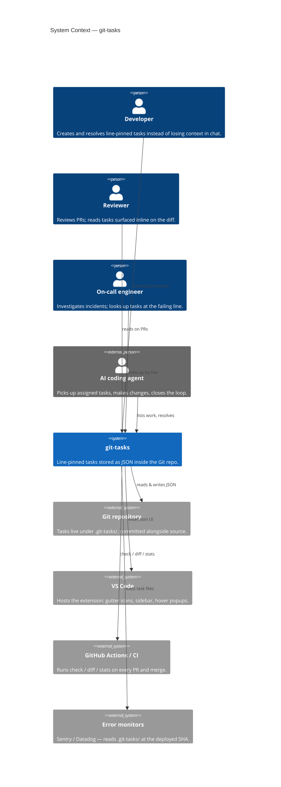

# Level 1 — System Context

The big picture: who uses git-tasks, what it does for them, and which external systems it touches.

## Why this shape

- **One system, many surfaces.** The same `.git-tasks/*.json` files feed the editor, the terminal, CI, and external monitors. There is no server, no API, no auth — the repo is the queue and the database.
- **Four audiences with the same data.** Humans and agents both create and resolve tasks; reviewers and on-call engineers mostly read; CI both reads (gate, report) and writes (auto-resolve via merge commit).
- **External systems are pull-based.** git-tasks doesn't push to GitHub or to Sentry; integrations read the JSON at a known commit. This is what makes it deployable as a thin reader anywhere.

## What's intentionally out of scope

- **No backend service.** There is no git-tasks server to host, scale, or secure.
- **No identity system.** Tasks carry `author` / `assignee` strings; matching against the active user happens locally via `git config user.email` and `user.name` (see [`src/gitHelper.ts`](../../src/gitHelper.ts)).
- **No notifications.** Slack / email integrations are templates teams add on top — the data is in the repo, the wiring is theirs.

Next: [Level 2 — Container](02-container.md).
