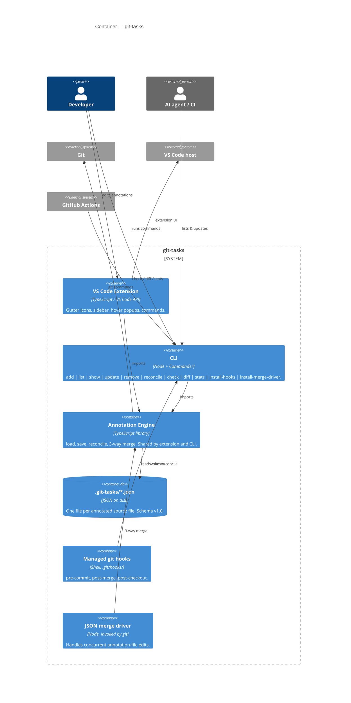

# Level 2 — Container

Zooming into the **git-tasks** system from [Level 1](01-context.md). "Container" here means a deployable / runnable unit.

## Containers in detail

### VS Code Extension (`src/extension.ts` + UI providers)

Activates on a workspace folder that's a Git repo. Registers:
- a `TreeView` (`gitTasksPanel`) backed by `SidebarProvider`,
- a `HoverProvider` for inline tooltips on lines with tasks,
- gutter `TextEditorDecorationType`s painted by `GutterProvider`,
- ten commands wired through `vscode.commands.registerCommand` (`addAnnotation`, `editAnnotation`, `resolveAnnotation`, `reopenAnnotation`, `deleteAnnotation`, `refreshPanel`, `reconcile`, filters, `openAnnotation`).

It owns no task logic — every mutation goes through the Annotation Engine.

### CLI (`cli/index.ts` + `cli/commands/*.ts`)

A Commander-based binary published as `git-tasks` (entry: `out/cli/index.js`). Each subcommand is a thin orchestrator: parse flags → call engine → format output (text or `--json`). Exit codes are part of the contract — `reconcile`, `check`, and `stats` use them as CI gates.

### Annotation Engine (`src/taskManager.ts` + `src/types.ts` + `src/gitHelper.ts`)

Pure-ish TypeScript: file I/O is contained, but the reconcile / merge / drift logic is all on top of plain strings and `AnnotationEntry` records. This is the only container both UI surfaces depend on, and the only one that touches `git` directly.

### Data store (`.git-tasks/*.json`)

The "database" — a directory of JSON files committed to the repo, mirroring source paths. Schema is versioned (`SCHEMA_VERSION = '1.0'` in [`src/types.ts`](../../src/types.ts:30)). One file per annotated source file; an empty file is deleted on the next save.

### Git hooks (managed block in `.git/hooks/`)

Installed by `git-tasks install-hooks`. Each hook is a small shell block delimited with `# >>> git-tasks (managed)` markers so it can be idempotently inserted, updated, and removed without disturbing user-authored hook content.

### Merge driver (registered in `.git/config` + `.gitattributes`)

`git-tasks install-merge-driver` registers `merge.git-tasks-json.driver = git-tasks merge-driver %O %A %B` and adds a `.gitattributes` line for `.git-tasks/**/*.json`. Git calls the driver with the three blobs (base / ours / theirs); the driver delegates to `mergeAnnotationFiles` in the engine.

## Data flow at a glance

1. **Create / mutate**: extension or CLI → engine → write `.git-tasks/<path>.json`.
2. **Read / display**: extension watches `.git-tasks/` (via `AnnotationsWatcher`), reloads on change, repaints UI. CLI reads on demand.
3. **Heal across merges**: hooks invoke `reconcile`; merge driver resolves concurrent JSON edits structurally instead of textually.
4. **Gate CI**: workflow runs `check` / `diff` / `stats`; non-zero exit fails the build — blocking unresolved tasks from reaching main.

Next: [Level 3 — Component](03-component.md).
