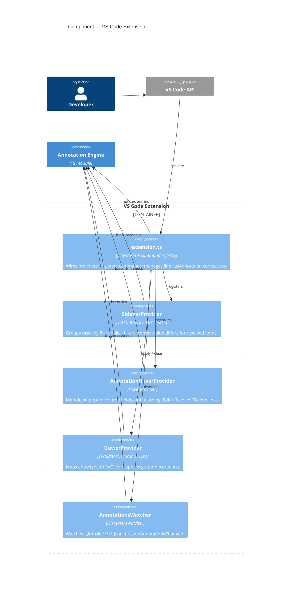
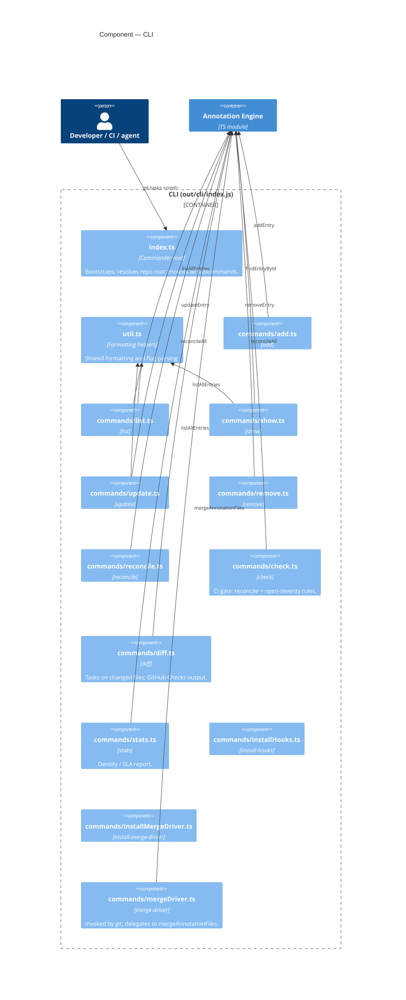
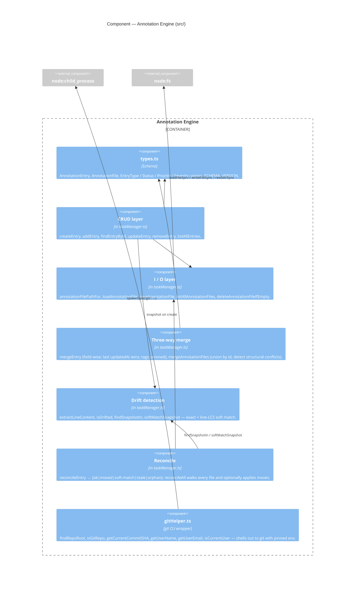

# Level 3 — Component

Zooming into the **VS Code Extension**, the **CLI**, and the **Annotation Engine** containers from [Level 2](02-container.md).

## VS Code Extension components

### Notes
- `extension.ts` is the only component allowed to call mutating engine functions; providers are read-only.
- The `gitTasks.lineHasAnnotation` context key (set on selection change) is what hides **Add Task** in the editor right-click menu when the cursor sits on a line that already has a task.
- The watcher is the *only* push channel into the UI — every other refresh is pulled by VS Code lifecycle events.

## CLI components

### Notes
- Every subcommand is a thin orchestrator. No business logic lives in `cli/commands/*` — they parse flags, call the engine, format output. `index.ts` mounts all of them via Commander; those arrows are omitted from the diagram to reduce clutter.
- `invocation.ts` (not shown) handles argv normalisation for node vs symlinked-bin invocations.
- `mergeDriver.ts` is a CLI subcommand only in the technical sense: git invokes it as `git-tasks merge-driver %O %A %B`. It's intentionally undocumented in `--help`.
- `check` and `diff` are the components that integrate with GitHub Actions; their exit codes and `--format json` / `--github-annotations` output are part of the public contract.

## Annotation Engine components

### Notes
- The engine has no VS Code or Commander imports — it's plain TS. That's what lets the same module power the editor, the CLI, and the merge driver.
- Boundaries between "I/O", "CRUD", "drift", "reconcile", "merge" are conceptual — they're all in `src/taskManager.ts` today, grouped here so the diagram stays readable. If the file grows further, splitting along these lines is the natural cut.
- `gitHelper.ts` is the only place that shells out. Tests pin `GIT_CONFIG_GLOBAL`/`SYSTEM` to `/dev/null` so the helper can never read the developer's global config (see [README.md:96-100](../../README.md)).

Next: [Level 4 — Code](04-code.md).
