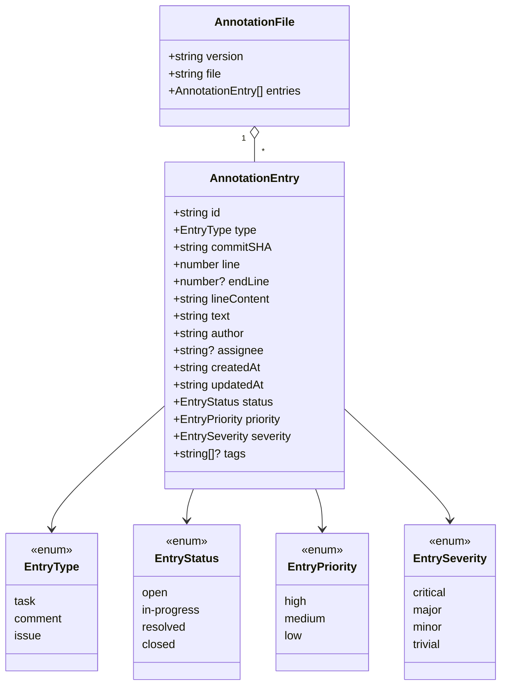
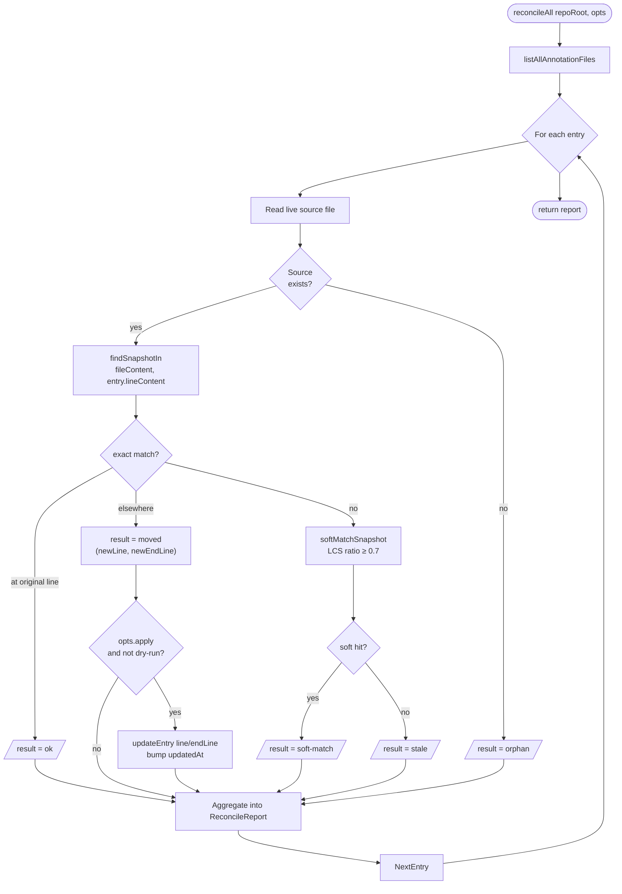
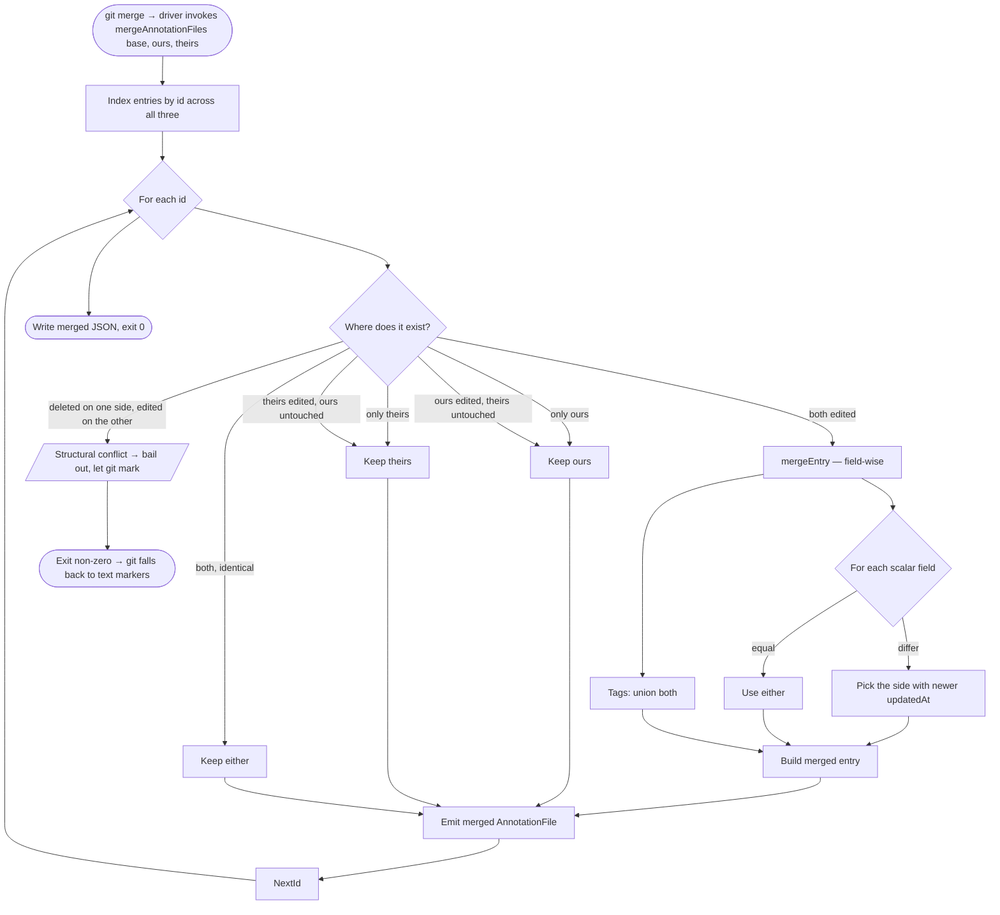

# Level 4 — Code

Zooming into the **Annotation Engine** from [Level 3](03-component.md). C4's "Code" level is for the few internal flows where the call graph and data shape are load-bearing for the design — for git-tasks that's the **schema**, the **reconcile flow**, and the **three-way merge**.

> File references in this document point at `src/taskManager.ts` unless stated otherwise.

## 1. Schema

The whole system is built on this record. See [`src/types.ts`](../../src/types.ts).

### Invariants
- `id` is a UUID v4 generated at `createEntry` time and never changes.
- `commitSHA` and `lineContent` are written once on creation; they're the anchor used by drift detection and are not updated when reconcile moves an entry.
- `line` ≤ `endLine`. `endLine` is omitted when the annotation covers a single line.
- `createdAt` and `updatedAt` are ISO-8601 UTC strings. `updatedAt` advances on every mutation — three-way merge relies on it.
- `SCHEMA_VERSION` is `'1.0'`. Any breaking change here is a coordinated migration across engine, CLI, extension, and merge driver.

## 2. Reconcile flow

`reconcileAll` is what makes the "annotations heal across merges" promise work. It walks every annotation file, and for each entry decides one of five outcomes.

### Outcomes

| Outcome | Meaning | Auto-applied? | Exit code impact (in `reconcile` / `check`) |
|---|---|---|---|
| `ok` | Snapshot matches at the recorded line range. | n/a | none |
| `moved` | Snapshot matches exactly at a different range. | yes (default) | none |
| `soft-match` | Snapshot found with ≥70 % line-LCS but not byte-exact. | no — human / agent review | reported, doesn't fail |
| `stale` | Snapshot no longer present in the file. | no | fails CI |
| `orphan` | Source file was deleted. | n/a | fails CI |

### Why this shape
- **Exact match before soft match** keeps confident moves silent and surfaces ambiguity only when needed.
- **Soft match is read-only** by design: a 70 % LCS hit could be the same code with a refactor, *or* an accidentally similar block elsewhere. Auto-relocating it would silently corrupt the pin.
- **`commitSHA` is the escape hatch.** Even if reconcile gives up (`stale` / `orphan`), the consumer can always `git show <commitSHA>:<file>` to recover the original context.

Implementation: [`reconcileEntry`](../../src/taskManager.ts#L348), [`reconcileAll`](../../src/taskManager.ts#L396), [`findSnapshotIn`](../../src/taskManager.ts#L270), [`softMatchSnapshot`](../../src/taskManager.ts#L317).

## 3. Three-way merge flow

Invoked by the registered git merge driver (`merge.git-tasks-json.driver`) whenever both sides edit the same `.git-tasks/*.json` file.

### Why this shape
- **Union by `id`, not by position.** Annotation files are not ordered, and concurrent additions on different lines should always combine without conflict.
- **Last `updatedAt` wins** is intentionally simple and predictable; it's the same rule a human would apply (newer note overrides older). Tags merge by union because they're additive metadata, not state.
- **Structural conflicts are honest.** "Deleted on one side, edited on the other" is genuinely ambiguous and we refuse to guess — git's normal conflict markers surface in the JSON, and the human resolves it.

Implementation: [`mergeAnnotationFiles`](../../src/taskManager.ts#L533), [`mergeEntry`](../../src/taskManager.ts#L470).

## 4. Where to make changes safely

| If you're changing... | Touch | Don't forget |
|---|---|---|
| The schema | `src/types.ts` | Bump `SCHEMA_VERSION`; update CLI `--json` consumers, the merge driver, the README schema block, and this doc. |
| Drift / soft-match logic | `findSnapshotIn`, `softMatchSnapshot`, threshold constant | `test/taskManager.test.ts` covers these as pure functions — extend the cases. |
| A new entry status / type / priority | `src/types.ts` unions + `ENTRY_*` arrays | Hover colors (`src/hoverProvider.ts`), sidebar `contextValue` (`src/sidebarProvider.ts`), CLI flag validation. |
| Reconcile rules (new outcome, new auto-apply criterion) | `reconcileEntry` + `ReconcileStatus` + `ReconcileReport` | `cli/commands/reconcile.ts` exit-code logic; `cli/commands/check.ts` failure flags. |
| Merge semantics | `mergeEntry`, `mergeAnnotationFiles` | The merge driver is invoked outside the editor — there's no UI fallback. Add unit tests in `test/taskManager.test.ts`. |

Back to [Level 1](01-context.md) · [Level 2](02-container.md) · [Level 3](03-component.md).
