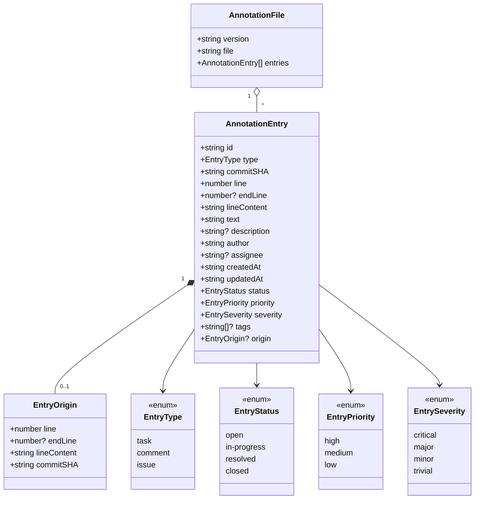
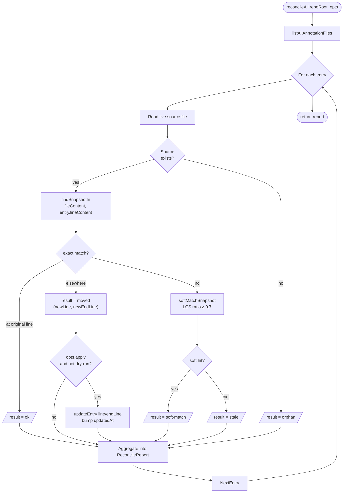
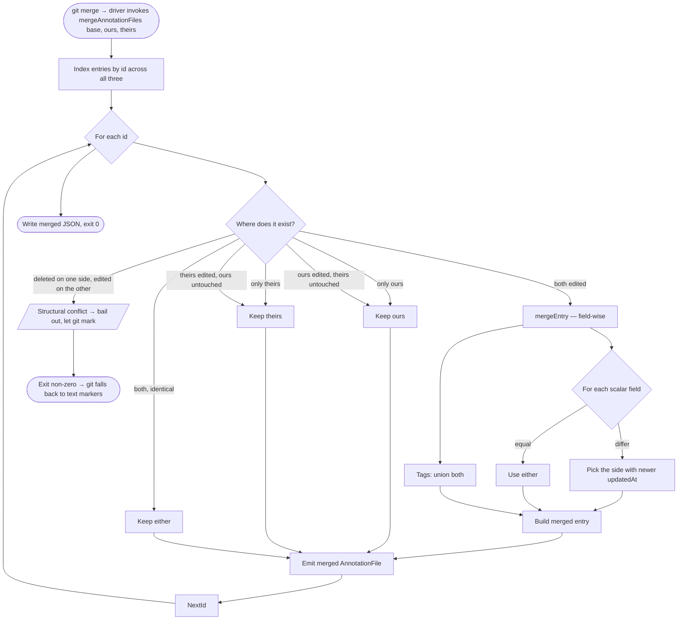

# Level 4 — Code

Zooming into the **Annotation Engine** from [Level 3](03-component.md). C4's "Code" level is for the few internal flows where the call graph and data shape are load-bearing for the design — for git-tasks that's the **schema**, the **reconcile flow**, and the **three-way merge**.

> File references in this document point at `src/taskManager.ts` unless stated otherwise.

## 1. Schema

The whole system is built on this record. See [`src/types.ts`](../../src/types.ts).

```mermaid
classDiagram
    class AnnotationFile {
        +string version
        +string file
        +AnnotationEntry[] entries
    }
    class AnnotationEntry {
        +string id
        +EntryType type
        +string commitSHA
        +number line
        +number? endLine
        +string lineContent
        +string text
        +string? description
        +string author
        +string? assignee
        +string createdAt
        +string updatedAt
        +EntryStatus status
        +EntryPriority priority
        +EntrySeverity severity
        +string[]? tags
        +EntryOrigin? origin
    }
    class EntryOrigin {
        +number line
        +number? endLine
        +string lineContent
        +string commitSHA
    }
    class EntryType { <<enum>>
        task
        comment
        issue
    }
    class EntryStatus { <<enum>>
        open
        in-progress
        resolved
        closed
    }
    class EntryPriority { <<enum>>
        high
        medium
        low
    }
    class EntrySeverity { <<enum>>
        critical
        major
        minor
        trivial
    }

    AnnotationFile "1" o-- "*" AnnotationEntry
    AnnotationEntry "1" *-- "0..1" EntryOrigin
    AnnotationEntry --> EntryType
    AnnotationEntry --> EntryStatus
    AnnotationEntry --> EntryPriority
    AnnotationEntry --> EntrySeverity
```

### Invariants
- `id` is a UUID v4 generated at `createEntry` time and never changes.
- `commitSHA` is written once on creation and never changes.
- `line` / `endLine` / `lineContent` describe the entry's **current** position. Reconcile rewrites all three when it relocates an entry (`relocateEntry`), re-snapshotting the content now under those lines so an exact-match relocation stays exact.
- `origin` describes the entry's **first** position and is write-once: stamped by `createEntry`, preserved verbatim by `updateEntry`, and treated as immutable by `mergeEntry`. Pre-1.1 entries have none; `ensureOrigin` backfills from the current pin on the first relocation, so the value is always a position the entry genuinely held.
- `line` ≤ `endLine`. `endLine` is omitted when the annotation covers a single line.
- `text` is a one-line title; `description` is optional long-form context. Neither is interpreted by the engine.
- `createdAt` and `updatedAt` are ISO-8601 UTC strings. `updatedAt` advances on every *human* mutation — three-way merge relies on it as the last-writer-wins tiebreaker.
- `drift` is **derived state**, and the only field on the entry that is not authored by a human. `reconcile --auto` recomputes it every run: written when an entry resolves to `soft-match` / `stale` / `orphan`, deleted when it resolves to `ok` / `moved`. Two consequences follow from it being derived. First, marking must not advance `updatedAt`, or a machine-written mark would outrank a concurrent human edit in `mergeEntry`. Second, since `updatedAt` therefore cannot order two competing marks, `mergeEntry` resolves `drift` outside the generic field loop (`pickDrift`): prefer the side that has a mark at all, and on disagreement keep the earlier `detectedAt`. `detectedAt` is likewise preserved across runs while the same `kind` persists, so it means "drifted since", not "last seen drifted".
- `SCHEMA_VERSION` is `'1.2'`. It is written on every save, so an older file is upgraded in place the first time it is touched. Reads are version-tolerant: every 1.1 and 1.2 addition is optional, so 1.0 files load unchanged. Any *breaking* change here is a coordinated migration across engine, CLI, extension, and merge driver.

## 2. Reconcile flow

`reconcileAll` is what makes the "annotations heal across merges" promise work. It walks every annotation file, and for each entry decides one of five outcomes.

```mermaid
flowchart TD
    Start([reconcileAll repoRoot, opts]) --> Walk[listAllAnnotationFiles]
    Walk --> Each{For each entry}
    Each --> ReadSrc[Read live source file]
    ReadSrc --> MissingSrc{Source<br/>exists?}
    MissingSrc -- no --> Orphan[/result = orphan/]
    MissingSrc -- yes --> Exact[findSnapshotIn<br/>fileContent, entry.lineContent]
    Exact --> ExactHit{exact match?}
    ExactHit -- "at original line" --> Ok[/result = ok/]
    ExactHit -- "elsewhere" --> Moved["result = moved<br/>(newLine, newEndLine)"]
    ExactHit -- no --> Soft[softMatchSnapshot<br/>LCS ratio ≥ 0.7]
    Soft --> SoftHit{soft hit?}
    SoftHit -- yes --> SoftMatch[/result = soft-match/]
    SoftHit -- no --> Stale[/result = stale/]

    Ok --> Tally
    Moved --> ApplyQ{opts.apply<br/>and not dry-run?}
    ApplyQ -- yes --> Write[updateEntry line/endLine<br/>bump updatedAt]
    ApplyQ -- no --> Tally
    Write --> Tally
    SoftMatch --> Tally
    Stale --> Tally
    Orphan --> Tally

    Tally[Aggregate into ReconcileReport] --> NextEntry
    NextEntry --> Each
    Each --> Return([return report])
```

### Outcomes

| Outcome | Meaning | Auto-applied? | Written to the entry | Exit code impact |
|---|---|---|---|---|
| `ok` | Snapshot matches at the recorded line range. | n/a | clears `drift` | none |
| `moved` | Snapshot matches exactly at a different range. | yes (default) | new pin, `origin` frozen, clears `drift` | none |
| `soft-match` | Snapshot found with ≥70 % line-LCS but not byte-exact. | no — human / agent review | `drift` mark with `suggestedLine` | none by default |
| `stale` | Snapshot no longer present in the file. | no | `drift` mark | none by default |
| `orphan` | Source file was deleted. | n/a | `drift` mark | none by default |

Only two opt-ins turn the last three into a failure: `reconcile --strict` (used by the `pre-commit` hook) and `check --fail-on <list>`. Nothing else does, deliberately — see below.

### Why this shape
- **Drift is recorded, never fatal.** Annotations describe code; they are not part of it. A pipeline that fails because a *comment about* line 321 now belongs on line 351 punishes every downstream consumer for a bookkeeping detail the tool can fix itself. So the unresolvable outcomes write a `drift` mark onto the entry and exit 0: the information is preserved, visible in `list --drifted` / `check` / the editor hover, and nothing is blocked. The one place blocking survives is the local `pre-commit` hook (`--strict`), where the friction lands on the one person who can act on it and is bypassable with `--no-verify`.
- **Exact match before soft match** keeps confident moves silent and surfaces ambiguity only when needed.
- **Soft match is read-only** by design: a 70 % LCS hit could be the same code with a refactor, *or* an accidentally similar block elsewhere. Auto-relocating it would silently corrupt the pin.
- **`commitSHA` is the escape hatch.** Even if reconcile gives up (`stale` / `orphan`), the consumer can always `git show <commitSHA>:<file>` to recover the original context.
- **Relocation is not loss.** `relocateEntry` freezes `origin` before it repoints the entry, so a move records history rather than overwriting it. That is what makes it safe to relocate aggressively and often.

### Where reconcile is triggered from

Detection is cheap; the design decision is *when* to apply it. Four triggers cover the ways an entry's line number goes stale, and all of them apply only the `moved` outcome:

| Trigger | Entry point | Scope |
|---|---|---|
| File saved in VS Code | `reconcileOnSave` → `reconcileFile` | the saved file only, from the editor buffer |
| `pre-commit` | `reconcile --auto` → `reconcileAll` | whole repo; re-stages `.git-tasks/` |
| `post-merge` / `post-checkout` | `reconcile --auto` → `reconcileAll` | whole repo |
| Merge driver | `relocateAgainstWorktree` → `relocateEntry` | the one file being merged |

`reconcileFile` exists so the editor does not walk the whole repo on every keystroke-to-save; it shares `reconcileLoadedFile` with `reconcileAll`, so both paths make identical decisions. The merge driver deliberately skips a source file that still carries conflict markers — line numbers computed against a conflicted file are meaningless, and `post-merge` will retry once the conflict is resolved.

Implementation: [`reconcileEntry`](../../src/taskManager.ts), [`reconcileFile`](../../src/taskManager.ts), [`reconcileAll`](../../src/taskManager.ts), [`relocateEntry`](../../src/taskManager.ts), [`findSnapshotIn`](../../src/taskManager.ts), [`softMatchSnapshot`](../../src/taskManager.ts).

## 3. Three-way merge flow

Invoked by the registered git merge driver (`merge.git-tasks-json.driver`) whenever both sides edit the same `.git-tasks/*.json` file.

```mermaid
flowchart TD
    Start([git merge → driver invokes mergeAnnotationFiles base, ours, theirs]) --> Index[Index entries by id across all three]
    Index --> EachId{For each id}

    EachId --> Case{Where does it exist?}

    Case -- "only ours" --> KeepOurs[Keep ours]
    Case -- "only theirs" --> KeepTheirs[Keep theirs]
    Case -- "both, identical" --> KeepEither[Keep either]
    Case -- "ours edited, theirs untouched" --> KeepOurs
    Case -- "theirs edited, ours untouched" --> KeepTheirs
    Case -- "both edited" --> Field[mergeEntry — field-wise]
    Case -- "deleted on one side, edited on the other" --> Conflict[/Structural conflict → bail out, let git mark/]

    Field --> FieldRule{For each scalar field}
    FieldRule -- "differ" --> LastWins[Pick the side with newer updatedAt]
    FieldRule -- "equal" --> Same[Use either]
    Field --> Tags[Tags: union both]
    LastWins --> Build
    Same --> Build
    Tags --> Build[Build merged entry]
    Build --> Tally

    KeepOurs --> Tally
    KeepTheirs --> Tally
    KeepEither --> Tally
    Tally[Emit merged AnnotationFile] --> NextId
    NextId --> EachId
    EachId --> Done([Write merged JSON, exit 0])

    Conflict --> Bail([Exit non-zero → git falls back to text markers])
```

### Why this shape
- **Union by `id`, not by position.** Annotation files are not ordered, and concurrent additions on different lines should always combine without conflict.
- **Last `updatedAt` wins** is intentionally simple and predictable; it's the same rule a human would apply (newer note overrides older). Tags merge by union because they're additive metadata, not state.
- **Structural conflicts are honest.** "Deleted on one side, edited on the other" is genuinely ambiguous and we refuse to guess — git's normal conflict markers surface in the JSON, and the human resolves it.

Implementation: [`mergeAnnotationFiles`](../../src/taskManager.ts#L533), [`mergeEntry`](../../src/taskManager.ts#L470).

## 4. Where to make changes safely

| If you're changing... | Touch | Don't forget |
|---|---|---|
| The schema | `src/types.ts` | Bump `SCHEMA_VERSION`; update CLI `--json` consumers, the merge driver, the README schema block, and this doc. |
| When reconcile runs | `src/extension.ts` (on save), `src/hooks.ts` (git hooks), `cli/commands/mergeDriver.ts` (merge) | All four paths funnel into `relocateEntry`; keep the relocation rule in one place rather than per-trigger. |
| Drift / soft-match logic | `findSnapshotIn`, `softMatchSnapshot`, threshold constant | `test/taskManager.test.ts` covers these as pure functions — extend the cases. |
| A new entry status / type / priority | `src/types.ts` unions + `ENTRY_*` arrays | Hover colors (`src/hoverProvider.ts`), sidebar `contextValue` (`src/sidebarProvider.ts`), CLI flag validation. |
| Reconcile rules (new outcome, new auto-apply criterion) | `reconcileEntry` + `ReconcileStatus` + `ReconcileReport` | `markDrift` / `clearDrift` mapping; `cli/commands/reconcile.ts` `--strict` exit-code logic; `cli/commands/check.ts` failure flags. |
| Merge semantics | `mergeEntry`, `mergeAnnotationFiles` | The merge driver is invoked outside the editor — there's no UI fallback. Add unit tests in `test/taskManager.test.ts`. |

Back to [Level 1](01-context.md) · [Level 2](02-container.md) · [Level 3](03-component.md).
